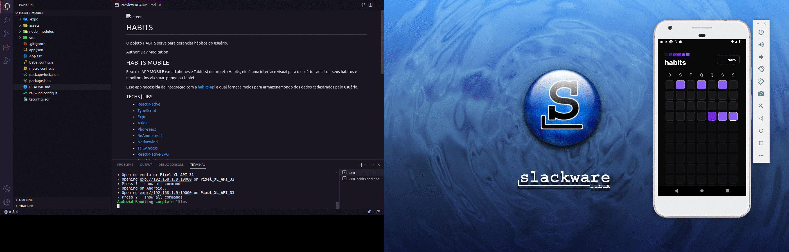

# HABITS 

O pojeto HABITS serve para gerenciar hábitos do usuário.

Author: Dev Meditation

## HABITS MOBILE

Esse é o APP MOBILE (smartphones e Tablets) do projeto Habits, ele é uma interface visual para o usuário cadastrar seus hábitos e monitora-los via smartphone ou tablet.

Esse app necessida de integração com a [habits-api](https://github.com/devmeditation/habits-web) a qual fornece meios para armazenamondo dos dados cadastrados pelo usuário.

### TECHS | LIBS

- [React-Native](https://reactnative.dev/)
- [TypeScript](https://www.typescriptlang.org/)
- [Expo](https://expo.dev/)
- [Axios](https://axios-http.com/)
- [Phor-react](https://phosphoricons.com/)
- [ReAnimated 2](https://www.reanimated2.com/)
- [Nativewind](https://www.nativewind.dev/)
- [Tailwindcss](https://tailwindcss.com/)
- [React-Native-SVG](https://www.npmjs.com/package/react-native-svg)
- [React-Native-web](https://www.npmjs.com/package/react-native-web)
- [React-Native-SVG-transformer](https://www.npmjs.com/package/react-native-svg-transformer)
- [DayJS](https://day.js.org/)
- [Zod Dev](https://zod.dev/)
- [CLSX](https://www.npmjs.com/package/clsx)
- [Git](https://git-scm.com/)

## CONTATO

- [BCL-LAB](https://youtube.com/@bcllab)

<!-- convert -delay 120 -loop 0 *.png habits-web_by_DevMeditation.gif -->